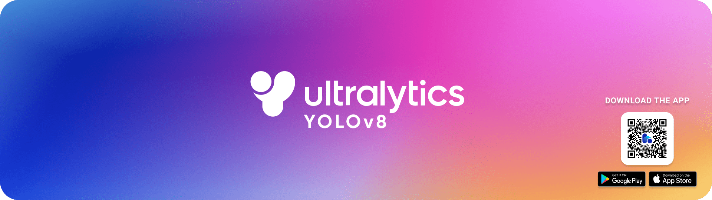

<div align="center">

# YOLOv8 Streamlit APP

  <p>
    <a align="center" href="https://ultralytics.com/yolov8" target="_blank">
      </a>
  </p>

<br>

<div>
    <a href="https://github.com/ultralytics/ultralytics/actions/workflows/ci.yaml"></a>
    <a href="https://zenodo.org/badge/latestdoi/264818686"></a>
    <a href="https://hub.docker.com/r/ultralytics/ultralytics"></a>
    <br>
    <a href="https://console.paperspace.com/github/ultralytics/ultralytics"></a>
    <a href="https://colab.research.google.com/github/ultralytics/ultralytics/blob/main/examples/tutorial.ipynb"></a>
    <a href="https://www.kaggle.com/ultralytics/yolov8"></a>
  </div>
  <br>
</div>

## Introduction
This repository supply a user-friendly interactive interface for [YOLOv8](https://github.com/ultralytics/ultralytics) and the interface is powered by [Streamlit](https://github.com/streamlit/streamlit). It could serve as a resource for future reference while working on your own projects.

## Features
- Feature1: Object detection task, segment task, pose task.
- Feature2:  
        
            Multiple detection models. `yolov8n`, `yolov8s`, `yolov8m`, `yolov8l`, `yolov8x`
            Multiple segment models. `yolov8n-seg`, `yolov8s-seg`, `yolov8m-seg`, `yolov8l-seg`, `yolov8x-seg`
            Multiple pose models. `yolov8n-pose`, `yolov8s-pose`, `yolov8m-pose`, `yolov8l-pose`, `yolov8x-pose`

- Feature3: Multiple input formats. `Image`, `Video`, `Webcam`

## Interactive Interface
### Image Input Interface


### Video Input Interface


### Webcam Input Interface


## Installation
### Create a new conda environment
```commandline
# create
conda create -n yolov8-streamlit python=3.8 -y

# activate
conda activate yolov8-streamlit
```
### Clone repository
```commandline
git clone https://github.com/chenanga/YOLOv8-streamlit-app
```

### Install packages
```commandline
# yolov8 dependencies
pip install ultralytics

# Streamlit dependencies
pip install streamlit
```
### Download Pre-trained YOLOv8 Detection Weights
Create a directory named `weights` and create a subdirectory named `detection` and save the downloaded YOLOv8 object detection weights inside this directory. The weight files can be downloaded from the table below.


---

| Model                                                                                | size<br><sup>(pixels) | mAP<sup>val<br>50-95 | Speed<br><sup>CPU ONNX<br>(ms) | Speed<br><sup>A100 TensorRT<br>(ms) | params<br><sup>(M) | FLOPs<br><sup>(B) |
| ------------------------------------------------------------------------------------ | --------------------- | -------------------- | ------------------------------ | ----------------------------------- | ------------------ | ----------------- |
| [YOLOv8n](https://github.com/ultralytics/assets/releases/download/v0.0.0/yolov8n.pt) | 640                   | 37.3                 | 80.4                           | 0.99                                | 3.2                | 8.7               |
| [YOLOv8s](https://github.com/ultralytics/assets/releases/download/v0.0.0/yolov8s.pt) | 640                   | 44.9                 | 128.4                          | 1.20                                | 11.2               | 28.6              |
| [YOLOv8m](https://github.com/ultralytics/assets/releases/download/v0.0.0/yolov8m.pt) | 640                   | 50.2                 | 234.7                          | 1.83                                | 25.9               | 78.9              |
| [YOLOv8l](https://github.com/ultralytics/assets/releases/download/v0.0.0/yolov8l.pt) | 640                   | 52.9                 | 375.2                          | 2.39                                | 43.7               | 165.2             |
| [YOLOv8x](https://github.com/ultralytics/assets/releases/download/v0.0.0/yolov8x.pt) | 640                   | 53.9                 | 479.1                          | 3.53                                | 68.2               | 257.8             |

| Model                                                                                        | size<br><sup>(pixels) | mAP<sup>box<br>50-95 | mAP<sup>mask<br>50-95 | Speed<br><sup>CPU ONNX<br>(ms) | Speed<br><sup>A100 TensorRT<br>(ms) | params<br><sup>(M) | FLOPs<br><sup>(B) |
| -------------------------------------------------------------------------------------------- | --------------------- | -------------------- | --------------------- | ------------------------------ | ----------------------------------- | ------------------ | ----------------- |
| [YOLOv8n-seg](https://github.com/ultralytics/assets/releases/download/v0.0.0/yolov8n-seg.pt) | 640                   | 36.7                 | 30.5                  | 96.1                           | 1.21                                | 3.4                | 12.6              |
| [YOLOv8s-seg](https://github.com/ultralytics/assets/releases/download/v0.0.0/yolov8s-seg.pt) | 640                   | 44.6                 | 36.8                  | 155.7                          | 1.47                                | 11.8               | 42.6              |
| [YOLOv8m-seg](https://github.com/ultralytics/assets/releases/download/v0.0.0/yolov8m-seg.pt) | 640                   | 49.9                 | 40.8                  | 317.0                          | 2.18                                | 27.3               | 110.2             |
| [YOLOv8l-seg](https://github.com/ultralytics/assets/releases/download/v0.0.0/yolov8l-seg.pt) | 640                   | 52.3                 | 42.6                  | 572.4                          | 2.79                                | 46.0               | 220.5             |
| [YOLOv8x-seg](https://github.com/ultralytics/assets/releases/download/v0.0.0/yolov8x-seg.pt) | 640                   | 53.4                 | 43.4                  | 712.1                          | 4.02                                | 71.8               | 344.1             |


| Model                                                                                        | size<br><sup>(pixels) | acc<br><sup>top1 | acc<br><sup>top5 | Speed<br><sup>CPU ONNX<br>(ms) | Speed<br><sup>A100 TensorRT<br>(ms) | params<br><sup>(M) | FLOPs<br><sup>(B) at 640 |
| -------------------------------------------------------------------------------------------- | --------------------- | ---------------- | ---------------- | ------------------------------ | ----------------------------------- | ------------------ | ------------------------ |
| [YOLOv8n-cls](https://github.com/ultralytics/assets/releases/download/v0.0.0/yolov8n-cls.pt) | 224                   | 66.6             | 87.0             | 12.9                           | 0.31                                | 2.7                | 4.3                      |
| [YOLOv8s-cls](https://github.com/ultralytics/assets/releases/download/v0.0.0/yolov8s-cls.pt) | 224                   | 72.3             | 91.1             | 23.4                           | 0.35                                | 6.4                | 13.5                     |
| [YOLOv8m-cls](https://github.com/ultralytics/assets/releases/download/v0.0.0/yolov8m-cls.pt) | 224                   | 76.4             | 93.2             | 85.4                           | 0.62                                | 17.0               | 42.7                     |
| [YOLOv8l-cls](https://github.com/ultralytics/assets/releases/download/v0.0.0/yolov8l-cls.pt) | 224                   | 78.0             | 94.1             | 163.0                          | 0.87                                | 37.5               | 99.7                     |
| [YOLOv8x-cls](https://github.com/ultralytics/assets/releases/download/v0.0.0/yolov8x-cls.pt) | 224                   | 78.4             | 94.3             | 232.0                          | 1.01                                | 57.4               | 154.8                    |

## Run
```commandline
streamlit run app.py
```
Then will start the Streamlit server and open your web browser to the default Streamlit page automatically.


## TODO List
- Add `Tracking` capability.
- ~~Add `Classification` capability~~.
- ~~Add `Pose estimation` capability~~.


***

If you also like this project, you may wish to give a `star` (^.^)✨ . If any questions, please raise `issue`~


Fork from https://github.com/JackDance/YOLOv8-streamlit-app